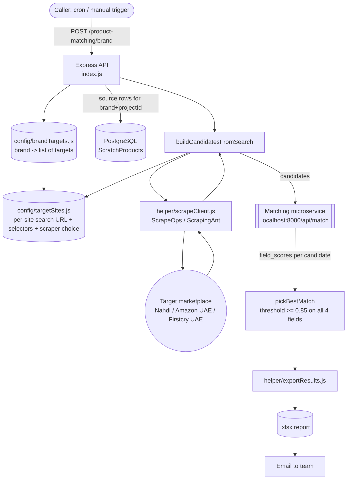

# Product Matching Engine — High-Level Design (HLD)

**Scope note:** this document covers the **forward-check only** — for a source brand's own
catalog, search a target marketplace and score candidate matches. Reverse-check is explicitly
**out of scope** for this document per current direction.

---

## 1. Purpose

We already run a product-matching check between **Mumzworld** (our catalog) and **Nahdi**
(a competitor marketplace) — for every Mumzworld product, search Nahdi and score how likely
each result is the same product. This engine generalizes that one hardcoded flow into a
**config-driven system** so the same matching logic can run for any brand against any target
marketplace, starting with **Teknum** against **Amazon UAE** and **Firstcry UAE**.

The goal is not a one-off script per brand/marketplace pair — it's a reusable engine where
adding a new brand or marketplace is a config change, not a code change.

---

## 2. System Architecture



---

## 3. Config Layer

Two config files carry every fact that used to be hardcoded to Nahdi. Adding a marketplace
or a brand means editing these, not the engine itself.

### 3.1 `config/targetSites.js` — per-marketplace definition

Each entry describes everything specific to one target site:

| Field | Purpose |
|---|---|
| `label` | Display name (used in reports/emails) |
| `scraper` | Which client `helper/scrapeClient.js` uses to fetch pages — `scrapeops` or `scrapingant` |
| `needsDetailFetch` | `true` → visit each candidate's own product page for full fields (Nahdi, Firstcry UAE). `false` → build the full candidate directly off the search-results page, no per-candidate second request (Amazon UAE) |
| `buildSearchUrl(query)` | Constructs the site's search URL for a query string |
| `extractListingLinks(doc)` | (detail-fetch sites only) pulls product links off the search-results page |
| `extractDetail(doc, link)` | (detail-fetch sites only) parses a single product page into `{title, brand, price, mrp, images, ...}` |
| `extractListingProducts(doc)` | (no-detail-fetch sites only) parses the search-results page directly into full candidate objects |

**Currently configured:**

| Target | `scraper` | `needsDetailFetch` | Notes |
|---|---|---|---|
| `nahdi` | ScrapeOps | true | Original flow, ported unchanged |
| `firstcryAE` | ScrapeOps | true | Selectors verified live 2026-07-21; no confirmed MRP sample yet, falls back to price |
| `amazonAE` | ScrapingAnt | false | Mirrors the proven pattern in `sellerpundit-backend/cluster-service/bulkUpload.js`. Uses Amazon's stable `data-component-type='s-search-result'` + `data-asin` hooks instead of a utility-class selector already found to be stale |

**Known gap:** Amazon UAE candidates carry no `brand` field (not present on the search-results
grid, and no detail-page visit happens for this target) — the matching service's brand-score
will be unreliable for Amazon UAE candidates specifically until/unless detail-page fetching
is added for it.

### 3.2 `config/brandTargets.js` — per-brand definition

Maps a brand name to the list of targets it should be checked against (forward direction
only, per this document's scope):

```js
Teknum: [
  { target: "amazonAE", direction: "forward" },
  { target: "firstcryAE", direction: "forward" },
]
```

A brand not listed here isn't affected by the new flow at all — it's only reachable via the
original single-target `/product-matching` endpoint (defaults to Nahdi), unchanged.

---

## 4. Matching Engine (`index.js`)

### 4.1 `buildCandidatesFromSearch(targetConfig, query)`

Given a target's config and a search query (a source product's title):
1. Builds the search URL via `targetConfig.buildSearchUrl(query)`.
2. Fetches it via `helper/scrapeClient.js` using whichever client the target's config names.
3. If `needsDetailFetch` is `false` → parses the search-results page directly into full
   candidate objects and returns them.
4. If `true` → extracts product links from the search page, then visits each one (throttled
   1s between requests) and parses it into a full candidate object via `extractDetail`.

Returns an array of candidate product objects, all normalized to the same shape regardless of
which target produced them (`title`, `brand`, `price`, `mrp`, `images`, `url`, `sku`, ...).

### 4.2 `callMatchingService(originalProduct, comparableProducts)`

Sends the source product plus its candidates to the external matching microservice
(`POST localhost:8000/api/match`), in batches of 5 candidates per request. Returns the
flattened array of per-candidate `field_scores` (`title`, `brand`, `color`, 
`image_similarity`).

### 4.3 `pickBestMatch(matchData)`

Walks the scored candidates and returns the first one where **every** field score
(`title`, `brand`, `color`, `image_similarity`) is `>= 0.85`. Returns `null` if none clear
that bar. This threshold and field set is unchanged from the original Nahdi flow.

### 4.4 `runBrandMatching(brandName, projectId)`

The new orchestration function for the config-driven flow:
1. Looks up `brandTargets[brandName]` — if none configured, throws.
2. Pulls the brand's own catalog rows from PostgreSQL (`ScratchProducts`, filtered by
   `brand` + `projectId`).
3. For each configured `{target, direction}` pair (forward only, per this document's scope):
   for every catalog row, calls `buildCandidatesFromSearch` against that target, sends
   candidates to the matching service, records whether a match was found and its scores.
4. Combines every target's results into one array, exports it to Excel
   (`helper/exportResults.js`), and emails the combined report.

---

## 5. Scraper Client Abstraction (`helper/scrapeClient.js`)

A single `fetchHtml(scraperType, url)` function dispatches to one of two proxy clients based
on the target's config:

| Client | Used for | Notes |
|---|---|---|
| **ScrapeOps** | Nahdi, Firstcry UAE | Escalates to "premium" rendering tier after the first failed attempt |
| **ScrapingAnt** | Amazon UAE | Same client + API key already proven in production (`cluster-service/bulkUpload.js`), `proxy_country: "AE"`, no browser rendering |

Both retry up to 3 times with a 1s backoff between attempts before the caller sees a failure.

---

## 6. API Surface

| Endpoint | Status | Behavior |
|---|---|---|
| `POST /product-matching` | Legacy, unchanged | `{ brand: [skus...], projectId, target? }` — checks a specific SKU list against one target (defaults to Nahdi). Existing callers keep working exactly as before. |
| `POST /product-matching/brand` | New | `{ brandName, projectId }` — runs every target configured for that brand in `brandTargets.js`, pulls the brand's whole catalog automatically (no SKU list needed), combines results into one spreadsheet. |

---

## 7. Data In / Data Out

**Input:** `ScratchProducts` table (PostgreSQL) — brand's own catalog rows, read by
`brand` + `projectId`. Fields used: `title`, `url`, `brand`, `sku`, `category`, `images`,
`attributes`, `price`, `mrp`.

**Output:** one `.xlsx` file per run (`helper/exportResults.js`), one row per source product,
with columns: target, source title/brand/SKU/URL/price, whether matched, matched
title/URL/price, and the four individual field scores. Emailed to the team alongside the
raw JSON (matched + errors) as attachments.

---

## 8. Extending This System

To add a new **marketplace**: add an entry to `config/targetSites.js` with its search URL
builder, scraper choice, and either `extractListingProducts` (no detail fetch) or
`extractListingLinks` + `extractDetail` (detail fetch).

To add a new **brand**: add an entry to `config/brandTargets.js` naming which already-
configured targets it should run against, with `direction: "forward"`.

No changes to `index.js`, `helper/scrapeClient.js`, or `helper/exportResults.js` are needed
for either case — that's the point of the config-driven split.
