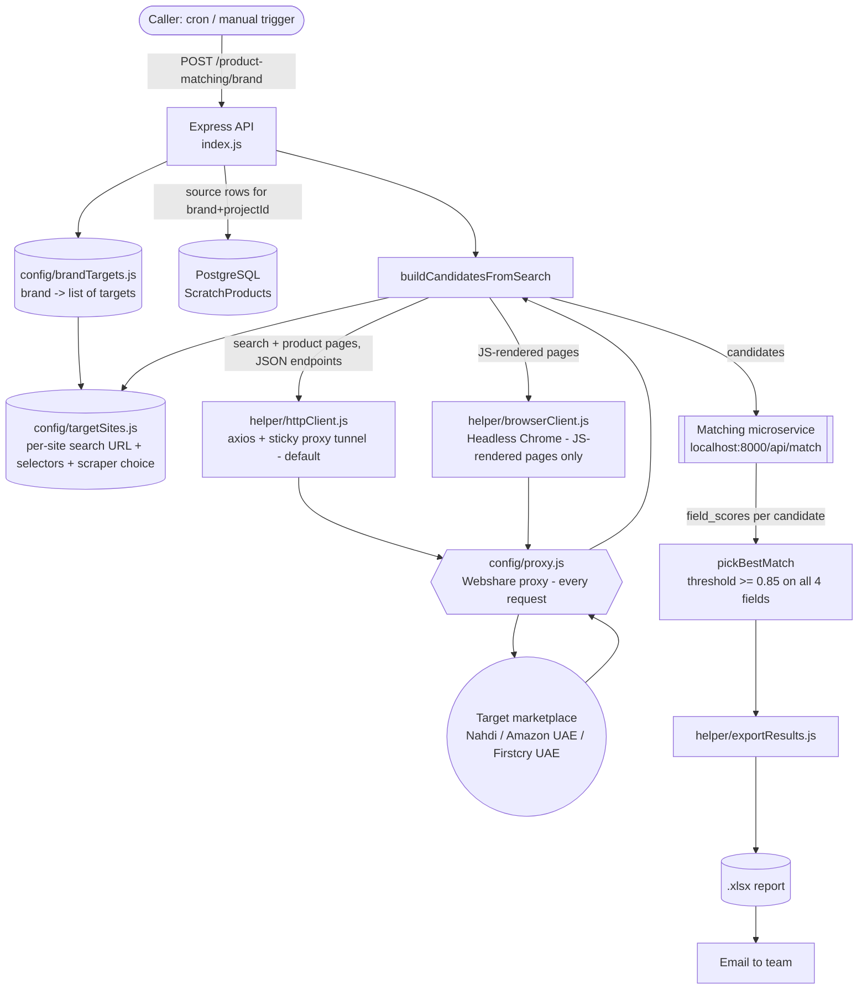

# Product Matching Engine — High-Level Design (HLD)

**Scope note:** this document covers the **forward-check only** — for a source brand's own
catalog, search a target marketplace and score candidate matches. Reverse-check is explicitly
**out of scope** for this document per current direction.

---

## 1. Purpose

We already run a product-matching check between **Mumzworld** (our catalog) and **Nahdi**
(a competitor marketplace) — for every Mumzworld product, search Nahdi and score how likely
each result is the same product. This engine generalizes that one hardcoded flow into a
**config-driven system** so the same matching logic can run for any brand against any target
marketplace, starting with **Teknum** against **Amazon UAE** and **Firstcry UAE**.

The goal is not a one-off script per brand/marketplace pair — it's a reusable engine where
adding a new brand or marketplace is a config change, not a code change.

---

## 2. System Architecture


```mermaid
flowchart TD
    Client([Caller: cron / manual trigger])
    API[Express API\nindex.js]
    BrandCfg[(config/brandTargets.js\nbrand -> list of targets)]
    SiteCfg[(config/targetSites.js\nper-site search URL + selectors + scraper choice)]
    DB[(PostgreSQL\nScratchProducts)]
    Search[buildCandidatesFromSearch]
    HttpClient[helper/httpClient.js\naxios + sticky proxy tunnel - default]
    ScrapeClient[helper/browserClient.js\nHeadless Chrome - JS-rendered pages only]
    Proxy{{config/proxy.js\nWebshare proxy - every request}}
    Target((Target marketplace\nNahdi / Amazon UAE / Firstcry UAE))
    MatchSvc[[Matching microservice\nlocalhost:8000/api/match]]
    Pick[pickBestMatch\nthreshold >= 0.85 on all 4 fields]
    Export[helper/exportResults.js]
    Excel[(.xlsx report)]
    Email[Email to team]

    Client -->|POST /product-matching/brand| API
    API --> BrandCfg
    BrandCfg --> SiteCfg
    API -->|source rows for brand+projectId| DB
    API --> Search
    Search --> SiteCfg
    Search -->|search + product pages, JSON endpoints| HttpClient
    Search -->|JS-rendered pages| ScrapeClient
    HttpClient --> Proxy
    ScrapeClient --> Proxy
    Proxy --> Target
    Target --> Proxy
    Proxy --> Search
    Search -->|candidates| MatchSvc
    MatchSvc -->|field_scores per candidate| Pick
    Pick --> Export
    Export --> Excel
    Excel --> Email
```

---

## 3. Config Layer

Two config files carry every fact that used to be hardcoded to Nahdi. Adding a marketplace
or a brand means editing these, not the engine itself.

### 3.1 `config/targetSites.js` — per-marketplace definition

Each entry describes everything specific to one target site:

| Field | Purpose |
|---|---|
| `label` | Display name (used in reports/emails) |
| `scraper` | Which fetch strategy `helper/scrapeClient.js` uses — `puppeteer` for every target today. The legacy names `scrapeops` / `scrapingant` are still accepted and map to the same in-browser fetch |
| `detailApi` | (mode 1) Read SKUs off the search page, then fetch every candidate from the site's own JSON endpoint in one batched request. Holds `extractListingSkus(doc)`, `batchSize`, `buildUrl(skus)` and `mapItem(item)`. Used by Nahdi |
| `needsDetailFetch` | (modes 2 and 3) `false` → build the full candidate directly off the search-results page, no per-candidate second request (Amazon UAE). `true` → visit each candidate's own product page for full fields (Firstcry UAE) |
| `buildSearchUrl(query)` | Constructs the site's search URL for a query string |
| `extractListingLinks(doc)` | (detail-fetch sites only) pulls product links off the search-results page |
| `extractDetail(doc, link)` | (detail-fetch sites only) parses a single product page into `{title, brand, price, mrp, images, ...}` |
| `extractListingProducts(doc)` | (no-detail-fetch sites only) parses the search-results page directly into full candidate objects |

**Currently configured:**

| Target | Mode | Requests per source product | Notes |
|---|---|---|---|
| `nahdi` | `needsDetailFetch: true` (axios) | 1 search page + ~20 product pages, all plain GETs on one tunnel | No browser at all. Verified live 2026-10-06: 20/20 candidates in ~41s, 21 requests on a single exit IP with 0 rotations; full title/brand/price/MRP/images/description. `detailApi` is the fallback |
| `firstcryAE` | `needsDetailFetch: true` | 1 browser page + 1 per candidate | Selectors verified live 2026-07-21; no confirmed MRP sample yet, falls back to price. Verified live through the proxy 2026-09-05. The most block-prone target — no known JSON endpoint yet |
| `amazonAE` | `needsDetailFetch: false` | 1 browser page (+ capped brand top-ups) | Uses Amazon's stable `data-component-type='s-search-result'` + `data-asin` hooks instead of a utility-class selector already found to be stale. **See the proxy-reputation caveat in section 5** |

**Known gap:** Amazon UAE candidates missing a `brand` on the search grid are topped up by the
`brandFallback` product-page fetch. That top-up depends on being able to load an Amazon product
page, which the current proxy pool frequently cannot — see section 5.

### 3.2 `config/brandTargets.js` — per-brand definition

Maps a brand name to the list of targets it should be checked against (forward direction
only, per this document's scope):

```js
Teknum: [
  { target: "amazonAE", direction: "forward" },
  { target: "firstcryAE", direction: "forward" },
]
```

A brand not listed here isn't affected by the new flow at all — it's only reachable via the
original single-target `/product-matching` endpoint (defaults to Nahdi), unchanged.

---

## 4. Matching Engine (`index.js`)

### 4.1 `buildCandidatesFromSearch(targetConfig, query)`

Given a target's config and a search query (a source product's title):
1. Builds the search URL via `targetConfig.buildSearchUrl(query)`.
2. Fetches it via `helper/scrapeClient.js`, which dispatches on `targetConfig.scraper` —
   `"axios"` (the default, a plain GET over the sticky proxy tunnel) or `"puppeteer"`.
3. Hands the parsed document to `buildCandidatesFromDoc()`.

### 4.2 `buildCandidatesFromDoc(targetConfig, doc, query)`

The mode dispatch, split out from the fetch so the legacy `/product-matching` flow — which
fetches its own search page — goes through exactly the same logic rather than its own copy.
Three modes, checked in this order:

- **`needsDetailFetch: true`** → `buildCandidatesFromDetailPages()` extracts product links and
  visits each one (throttled 1s between requests), parsing it via `extractDetail`. One request
  per candidate, and the richest data. **If every page failed and the target also has a
  `detailApi`, it falls back to the bulk endpoint** rather than returning nothing for that
  source product.
- **`detailApi` set, no detail-page pass** → `buildCandidatesFromApi()` reads the SKUs off the
  search page, de-dupes them, and fetches every candidate from the site's own JSON endpoint in
  batches of `batchSize` (throttled 1s between batches).
- **neither** → parses the search-results page directly into full candidate objects. No second
  request at all.

Returns an array of candidate product objects, all normalized to the same shape regardless of
which target or which mode produced them (`title`, `brand`, `price`, `mrp`, `images`, `url`,
`sku`, ...).

A failed batch or a failed detail page costs only its own candidates — the rest of the set is
still returned.

### 4.3 `callMatchingService(originalProduct, comparableProducts)`

Sends the source product plus its candidates to the external matching microservice
(`POST localhost:8000/api/match`), in batches of 5 candidates per request. Returns the
flattened array of per-candidate `field_scores` (`title`, `brand`, `color`, 
`image_similarity`).

### 4.4 `pickBestMatch(matchData)`

Walks the scored candidates and returns the first one where **every** field score
(`title`, `brand`, `color`, `image_similarity`) is `>= 0.85`. Returns `null` if none clear
that bar. This threshold and field set is unchanged from the original Nahdi flow.

### 4.5 `runBrandMatching(brandName, projectId)`

The new orchestration function for the config-driven flow:
1. Looks up `brandTargets[brandName]` — if none configured, throws.
2. Pulls the brand's own catalog rows from PostgreSQL (`ScratchProducts`, filtered by
   `brand` + `projectId`).
3. For each configured `{target, direction}` pair (forward only, per this document's scope):
   for every catalog row, calls `buildCandidatesFromSearch` against that target, sends
   candidates to the matching service, records whether a match was found and its scores.
4. Combines every target's results into one array, exports it to Excel
   (`helper/exportResults.js`), and emails the combined report.

---

## 5. Fetch Layer

Two clients. **Every request from either one goes through the Webshare proxy** (`config/proxy.js`,
`http://p.webshare.io:80`) — nothing ever leaves from the host's own IP, so the host's address
cannot be the thing that gets blocked.

| Client | What it fetches | Why |
|---|---|---|
| `helper/httpClient.js` | Nahdi search + product pages, and sites' own JSON endpoints | Plain axios GET with a real browser's headers over a **sticky** proxy tunnel. ~0.7-2.5s a page. The default |
| `helper/browserClient.js` (via `helper/scrapeClient.js`) | Amazon UAE, Firstcry UAE | Real headless Chrome. Only needed where a page's data is injected by its own JavaScript |

A target picks between them with `scraper: "axios"` or `scraper: "puppeteer"`. This replaced the
ScrapeOps and ScrapingAnt HTTP proxy APIs, removing the per-request credit cost and the
dependency on a third party's rendering tier.

### 5.0 Proxy credentials (deployment requirement)

`config/proxy.js` holds **no** baked-in credentials — a proxy password in git history is not
something you can take back. It reads them in this order:

1. Env vars — `PROXY_HOST`, `PROXY_PORT`, `PROXY_USERNAME`, `PROXY_PASSWORD`
2. `config.json` — `PROXY_Host`, `PROXY_Port`, `PROXY_Username`, `PROXY_Password` (gitignored,
   the same file `SMTP_*` already lives in)

Host and port default to `p.webshare.io:80`; username and password have no default. **A fresh
checkout or a new deployment must supply them** or every fetch fails with a proxy auth error —
`config/proxy.js` logs a loud startup error saying exactly that rather than letting the failure
surface as an opaque `HTTP 407` per request.

```json
"PROXY_Host":     "p.webshare.io",
"PROXY_Port":     "80",
"PROXY_Username": "...",
"PROXY_Password": "..."
```

### 5.1 Sticky exit IP, rotated only on failure

**The exit IP is a property of the TCP connection, not of the request.** A keep-alive agent holds
one CONNECT tunnel open, so every request through it leaves from the same address; destroying the
agent forces a new tunnel and a new address. Verified 2026-10-06 against `api.ipify.org` — five
calls on one agent all reported `82.23.215.193`, then a fresh agent reported `174.140.200.107`
and a third `82.21.244.77`.

`helper/httpClient.js` is built on that: **hold one IP and make as many calls through it as it
will take; change IP only on evidence it has stopped working** — a network error, an HTTP error,
or a block/captcha page. Nothing rotates on a success. Each failure rotates before the next of
3 attempts, so a retry is genuinely a different client.

This was observed working in a live run: a product page returned `HTTP 403`, the client logged
`proxy: rotating exit IP after 1 request(s) on session #1`, and the retry on the new IP
succeeded — the candidate was not lost.

Holding the tunnel open is also what makes this fast. The first request pays ~1.2-1.5s for the
proxy handshake; every one after it pays ~350ms. Rotating per request would pay that handshake
every time — which is exactly why the earlier axios-with-`proxy`-option path cost ~3.0s per call.

### 5.2 Why Nahdi no longer needs the browser at all

Verified live 2026-10-06: Nahdi's search page **and** its product pages both answer `HTTP 200` to
a plain GET carrying a real browser's headers, with **no cookies at all** — no Cloudflare
clearance needed, contrary to the earlier assumption that the `cf_clearance` cookie was load-bearing.

That changed the economics completely. A product page is a ~1s GET instead of a ~13s Chrome
navigation, so a page per candidate is affordable again — and the page carries what the JSON
endpoint cannot:

| Per source product | Browser, page per candidate | Bulk JSON endpoint | **Now: axios, page per candidate** |
|---|---|---|---|
| Requests | 1 + ~20 Chrome navigations | 1 Chrome navigation + 1 API call | 1 + ~20 plain GETs, one tunnel |
| Time | ~4.5 min | ~30s | **~41s** |
| Blocked mid-run | Yes | No | No — 21 requests on one IP, 0 rotations |
| Images per candidate | ~11 | 1 | **up to 11 (avg 4.5)** |
| Description | Yes | No | **Yes (345-2348 chars)** |
| Price correct | No (see below) | Yes | **Yes** |

Measured on a 20-candidate search: 20/20 candidates, full coverage of title, brand, SKU, price,
MRP, images and description.

### 5.3 Reading the page's JSON-LD instead of its CSS classes

`nahdi.extractDetail` takes every structured field from the page's schema.org `Product` block
(`<script type="application/ld+json">`), not from utility classes. Sites maintain these for
Google, so they are far more stable than a Tailwind/Next.js storefront's class strings — and the
class-based selectors this replaced were not just fragile, they were **wrong in two places**:

- **Price.** The old selector found the right `<div>`, but Nahdi renders the SAR symbol as an
  inline `<svg>` whose `<style>` text lands inside it. `textContent` was
  `".sar_symbol_svg__cls-1{fill:#231f20}254.00"`, so `parseFloat()` returned `NaN` and fell
  through to the MRP. That is how SKU `103804790` was recorded at **878.60 for a product that
  sells for 254.00**. The JSON-LD `AggregateOffer` gives `lowPrice` / `highPrice` directly, and
  cross-checks exactly against both the visible page price and the storefront API.
- **Images.** The old gallery selector matches **nothing** on the served HTML (0 hits) — the
  carousel is built client-side. The JSON-LD carries all 11 image URLs.

`description` is the one field still read from the page body (`div.pdp-about-section`), because
the JSON-LD only repeats the product name there.

**Known data gap:** `category` comes back empty for products Nahdi has not categorised — their
JSON-LD has no `category` and their breadcrumb is literally `Home > > <product name>`. The
breadcrumb fallback is working correctly; there is simply nothing there. Category is not one of
the four match gates, so this is cosmetic.

### 5.4 The bulk endpoint, now a fallback

`nahdi.detailApi` (`/api/analytics/product?skus=...&language=en&region=SA`) is still configured
and still works — 20 SKUs in 16 KB, 0.33s direct / ~3.0s proxied. It is now used **only when
every product page for a source product failed**, because it carries just the main catalogue
image where the page carries up to 11.

Product URLs from it are rebuilt as `https://www.nahdionline.com/en-sa` + `item_link`. The locale
prefix is required, not cosmetic: verified that the same path without `/en-sa` serves the Arabic
page, the same class of bug as Amazon's `/-/en/` prefix.

### 5.5 `helper/browserClient.js`

Owns the browser:

| Concern | How it's handled |
|---|---|
| **Browser lifetime** | One instance per process, launched lazily on the first fetch and kept warm. Closed on `SIGINT`/`SIGTERM` and at the end of the legacy flow |
| **Proxy auth** | `page.authenticate()` per page, from `config/proxy.js` (see 5.0 for where credentials come from) |
| **IP rotation** | Each fetch runs in its own incognito `BrowserContext`. This is what actually rotates the exit IP: Chrome pools proxy connections per network context, so a second page in the shared default context reuses the first one's tunnel and its IP. Measured 2026-09-05 against `api.ipify.org` — two pages in the default context both reported `23.27.138.99`, while two fresh contexts reported `107.175.56.181` and `89.116.78.119` |
| **Bandwidth** | `image` / `media` / `font` requests are aborted — nothing here reads a rendered pixel. Stylesheets are kept, since some sites gate content rendering on their CSS having loaded |
| **`renderJs: false`** | Returns at `domcontentloaded` instead of waiting for `networkidle2`, for targets whose fields are server-rendered |
| **Block detection** | Anti-bot interstitials are served with HTTP 200, so a status check alone waves them through and the extractors then report "no products found" or a silently blank field. Known captcha/challenge pages are detected and thrown, which is what lets the retry loop rotate onto a different exit IP |

`fetchHtml` retries up to 3 times with a 1s backoff. A retry is meaningful because each attempt
takes a new context, and therefore a new exit IP.

### 5.6 `helper/httpClient.js` reference

| Export | Purpose |
|---|---|
| `fetchPage(url, options)` | GET HTML. Sends the full Edge header set (`sec-ch-ua`, `sec-fetch-*`, `upgrade-insecure-requests`, …) so the request looks like a navigation. Throws on HTTP ≥ 400 and on a detected block page |
| `fetchJson(url, options)` | GET JSON from a storefront endpoint, same session and same rotation policy |
| `rotateSession(reason)` | Force the next request onto a new exit IP. Called internally on failure; exposed for a caller that detects a block of its own |
| `closeSession()` | Drop the tunnel (process shutdown) |
| `sessionInfo()` | `{ sessionNumber, requestsThisSession, active }` — how long the current IP has lasted |

Both fetchers: 3 attempts, 1s backoff, 60s timeout, exit IP rotated between attempts and after a
final failure (so the next caller doesn't inherit a session that just proved bad). HTTP status is
evaluated in-client (`validateStatus: () => true`) so a 403/503 challenge rotates rather than
surfacing as a bare axios error.

**404 and 410 are the exception** — they say "this URL is gone", not "this IP is unwelcome", so
they throw immediately with no rotation and the working session is kept for the next candidate.
Rotating for them would burn two extra requests and two exit IPs to be told the same thing.

Block detection lives in `helper/blockDetect.js`, shared with the browser client so both paths
agree on what "blocked" means: known captcha/challenge phrases, plus a size floor — any response
under 8 KB is treated as a block, since the smallest genuine page any target serves is ~667 KB.

### 5.7 Proxy reputation caveat (Amazon UAE)

Verified live 2026-09-05: Nahdi and Firstcry UAE fetch reliably through the proxy — search and
detail pages, with correct titles, brands and prices. **Amazon UAE does not.** The first request
from a fresh IP succeeds (a full 1.45 MB results page, 48 products, correct English titles), but
amazon.ae then blocks the pool, after which search URLs fail with `ERR_INVALID_RESPONSE` and
`/dp/` pages return a ~4 KB captcha interstitial.

This is IP reputation, not a bug in the fetch code: the identical Puppeteer setup pointed
directly at amazon.ae with no proxy returns the full page, 48 results, no captcha. Webshare's
rotating pool is datacenter IP space, which Amazon scores far more harshly than the residential
exits ScrapeOps was routing through. Neither `--disable-blink-features=AutomationControlled`, an
`Accept-Language` header, nor allowing all subresources to load changed the outcome.

The options are all operational rather than code changes here: point amazon.ae at a
residential/ISP proxy pool, keep a paid scraping API for that one target, or let amazon.ae
bypass the proxy where the host IP's own reputation is good enough.

The durable fix for a blocking target is the one applied to Nahdi in section 5.1 — find the
endpoint the site's own storefront calls and read that instead. Firstcry UAE is the remaining
candidate for the same treatment; it is still on one product page per candidate.

---

## 6. API Surface

| Endpoint | Status | Behavior |
|---|---|---|
| `POST /product-matching` | Legacy, unchanged | `{ brand: [skus...], projectId, target? }` — checks a specific SKU list against one target (defaults to Nahdi). Existing callers keep working exactly as before. |
| `POST /product-matching/brand` | New | `{ brandName, projectId }` — runs every target configured for that brand in `brandTargets.js`, pulls the brand's whole catalog automatically (no SKU list needed), combines results into one spreadsheet. |

---

## 7. Data In / Data Out

**Input:** `ScratchProducts` table (PostgreSQL) — brand's own catalog rows, read by
`brand` + `projectId`. Fields used: `title`, `url`, `brand`, `sku`, `category`, `images`,
`attributes`, `price`, `mrp`.

**Output:** one `.xlsx` file per run (`helper/exportResults.js`), one row per source product,
with columns: target, source title/brand/SKU/URL/price, whether matched, matched
title/URL/price, and the four individual field scores. Emailed to the team alongside the
raw JSON (matched + errors) as attachments.

---

## 8. Extending This System

To add a new **marketplace**: add an entry to `config/targetSites.js` with its search URL
builder, scraper choice, and either `extractListingProducts` (no detail fetch) or
`extractListingLinks` + `extractDetail` (detail fetch).

To add a new **brand**: add an entry to `config/brandTargets.js` naming which already-
configured targets it should run against, with `direction: "forward"`.

No changes to `index.js`, `helper/scrapeClient.js`, or `helper/exportResults.js` are needed
for either case — that's the point of the config-driven split.
